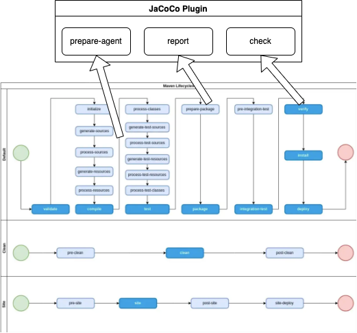
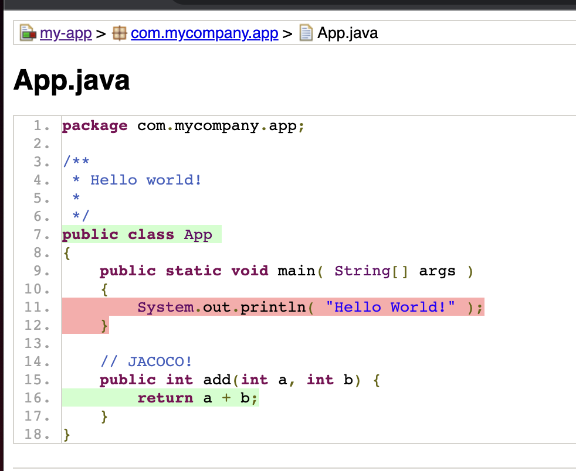

# Example Java Maven Library: Part 2

The purpose of this project is to be a basic Java library that is built using Maven, with the additional intention of adding to it common software utilities step-by-step. In this step, we are adding the Jacoco Plugin and putting in place a code coverage gate.

Prerequisites

- Git Setup: https://github.com/jvalentino/setup-git
- Building Java 101: https://github.com/jvalentino/java-building-101
- Maven Part 1: https://github.com/jvalentino/example-java-maven-lib-1

# (1) What is Code Coverage?

> Code coverage tools will use one or more criteria to determine how your code was exercised or not during the execution of your test suite. The common metrics that you might see mentioned in your coverage reports include:
>
> - **Function coverage:** how many of the functions defined have been called.
> - **Statement coverage:** how many of the statements in the program have been executed.
> - **Branches coverage:** how many of the branches of the control structures (if statements for instance) have been executed.
> - **Condition coverage:** how many of the boolean sub-expressions have been tested for a true and a false value.
> - **Line coverage:** how many of lines of source code have been tested.
>
> These metrics are usually represented as the number of items actually tested, the items found in your code, and a coverage percentage (items tested / items found).

- https://www.atlassian.com/continuous-delivery/software-testing/code-coverage

# (2) What is Jacoco?

> **Java code coverage tools** are of two types: first, tools that add statements to the [Java](https://en.wikipedia.org/wiki/Java_(programming_language)) [source code](https://en.wikipedia.org/wiki/Source_code) and require its recompilation. Second, tools that instrument the [bytecode](https://en.wikipedia.org/wiki/Bytecode), either before or during execution. The goal is to find out which parts of the code are tested by registering the lines of [code executed](https://en.wikipedia.org/wiki/Code_coverage) when running a test.

- https://en.wikipedia.org/wiki/Java_code_coverage_tools

# (3) Having actual testing

## App.java

```java
public class App 
{
    public static void main( String[] args )
    {
        System.out.println( "Hello World!" );
    }

  // JACOCO!
    public int add(int a, int b) {
        return a + b;
    }
}
```

## AppTest.java

```java
public class AppTest 
{
    /**
     * Rigorous Test :-)
     */
    @Test
    public void shouldAnswerWithTrue()
    {
        App subject = new App();
        int c = subject.add(1, 2);
        assertEquals(c, 3);
    }
}
```

# (4) pom.xml

```xml
 <!-- JACOCO! -->
        <plugin>
          <groupId>org.jacoco</groupId>
          <artifactId>jacoco-maven-plugin</artifactId>
          <version>0.8.8</version>
          <executions>
            <execution>
              <id>jacoco-prepare</id>
              <goals>
                <goal>prepare-agent</goal>
              </goals>
            </execution>
            <execution>
              <id>jacoco-check</id>
              <goals>
                 <goal>check</goal>
              </goals>
              <configuration>
                 <rules>
                    <rule>
                       <element>CLASS</element>
                       <limits>
                          <limit>
                             <counter>LINE</counter>
                             <value>COVEREDRATIO</value>
                             <minimum>0.49</minimum>
                          </limit>
                       </limits>
                    </rule>
                 </rules>
              </configuration>
           </execution>
            <execution>
              <id>jacoco-report</id>
              <phase>prepare-package</phase>
              <goals>
                <goal>report</goal>
              </goals>
            </execution>
          </executions>
        </plugin>

<!-- ... -->

 <!-- JACOCO! -->
  <reporting>
    <plugins>
      <plugin>
        <groupId>org.jacoco</groupId>
        <artifactId>jacoco-maven-plugin</artifactId>
        <reportSets>
          <reportSet>
            <reports>
              <report>report</report>
            </reports>
          </reportSet>
        </reportSets>
      </plugin>
    </plugins>
  </reporting>
```

# (5) The New Life Cycle



# (6) Verify

```bash
./mvnw clean verify

[INFO] Scanning for projects...
[INFO] 
[INFO] ----------------------< com.mycompany.app:my-app >----------------------
[INFO] Building my-app 1.0
[INFO] --------------------------------[ jar ]---------------------------------
[INFO] 
[INFO] --- maven-clean-plugin:3.1.0:clean (default-clean) @ my-app ---
[INFO] Deleting /Users/john.valentino/workspaces/personal/example-java-maven-lib-2/target
[INFO] 
[INFO] --- jacoco-maven-plugin:0.8.8:prepare-agent (jacoco-prepare) @ my-app ---
[INFO] argLine set to -javaagent:/Users/john.valentino/.m2/repository/org/jacoco/org.jacoco.agent/0.8.8/org.jacoco.agent-0.8.8-runtime.jar=destfile=/Users/john.valentino/workspaces/personal/example-java-maven-lib-2/target/jacoco.exec
[INFO] 
[INFO] --- maven-resources-plugin:3.0.2:resources (default-resources) @ my-app ---
[INFO] Using 'UTF-8' encoding to copy filtered resources.
[INFO] skip non existing resourceDirectory /Users/john.valentino/workspaces/personal/example-java-maven-lib-2/src/main/resources
[INFO] 
[INFO] --- maven-compiler-plugin:3.8.0:compile (default-compile) @ my-app ---
[INFO] Changes detected - recompiling the module!
[INFO] Compiling 1 source file to /Users/john.valentino/workspaces/personal/example-java-maven-lib-2/target/classes
[INFO] 
[INFO] --- maven-resources-plugin:3.0.2:testResources (default-testResources) @ my-app ---
[INFO] Using 'UTF-8' encoding to copy filtered resources.
[INFO] skip non existing resourceDirectory /Users/john.valentino/workspaces/personal/example-java-maven-lib-2/src/test/resources
[INFO] 
[INFO] --- maven-compiler-plugin:3.8.0:testCompile (default-testCompile) @ my-app ---
[INFO] Changes detected - recompiling the module!
[INFO] Compiling 1 source file to /Users/john.valentino/workspaces/personal/example-java-maven-lib-2/target/test-classes
[INFO] 
[INFO] --- maven-surefire-plugin:2.22.1:test (default-test) @ my-app ---
[INFO] 
[INFO] -------------------------------------------------------
[INFO]  T E S T S
[INFO] -------------------------------------------------------
[INFO] Running com.mycompany.app.AppTest
[INFO] Tests run: 1, Failures: 0, Errors: 0, Skipped: 0, Time elapsed: 0.021 s - in com.mycompany.app.AppTest
[INFO] 
[INFO] Results:
[INFO] 
[INFO] Tests run: 1, Failures: 0, Errors: 0, Skipped: 0
[INFO] 
[INFO] 
[INFO] --- jacoco-maven-plugin:0.8.8:report (jacoco-report) @ my-app ---
[INFO] Loading execution data file /Users/john.valentino/workspaces/personal/example-java-maven-lib-2/target/jacoco.exec
[INFO] Analyzed bundle 'my-app' with 1 classes
[INFO] 
[INFO] --- maven-jar-plugin:3.0.2:jar (default-jar) @ my-app ---
[INFO] Building jar: /Users/john.valentino/workspaces/personal/example-java-maven-lib-2/target/my-app-1.0.jar
[INFO] 
[INFO] --- jacoco-maven-plugin:0.8.8:check (jacoco-check) @ my-app ---
[INFO] Loading execution data file /Users/john.valentino/workspaces/personal/example-java-maven-lib-2/target/jacoco.exec
[INFO] Analyzed bundle 'my-app' with 1 classes
[INFO] All coverage checks have been met.
[INFO] ------------------------------------------------------------------------
[INFO] BUILD SUCCESS
[INFO] ------------------------------------------------------------------------
[INFO] Total time:  1.832 s
[INFO] Finished at: 2022-12-21T11:35:50-06:00
[INFO] ------------------------------------------------------------------------
```

# (7) Code Coverage Reporting

